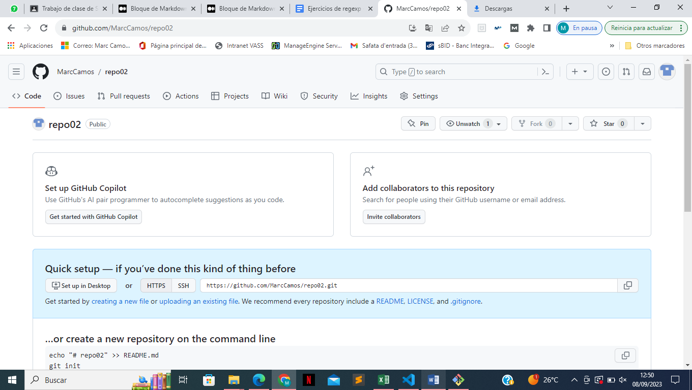
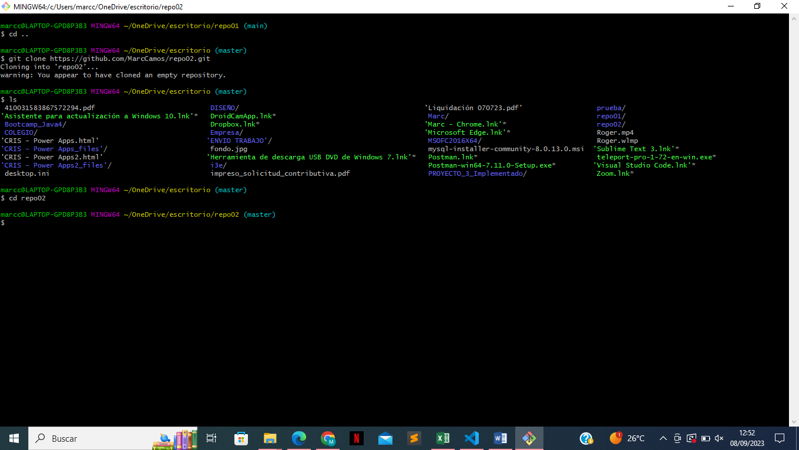
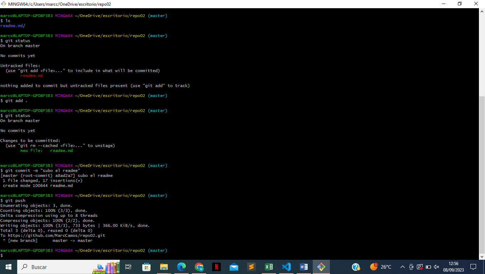

EJERCICIO 2:

□ 2.1 - Crea un repositorio llamado repo02 desde GitHub. ¿Sería considerado un repositorio
local o remoto?
 
□ 2.2 – Posteriormente, clónalo (mediante al comando git clone), lo que realizará una copia
del repositorio remoto en nuestro equipo, creando con ello un repositorio local a partir del
repositorio en remoto
 
□ 2-3 - Añade un fichero readme.md y ejecuta los comandos pertinentes hasta llegar a poder
realizar un commit.

□ 2.4 – Entra en este manual de Markdown y haz un resumen de los principales comandos de
Git con los que hemos trabajando. Puedes utilizar tablas, imágenes, títulos, enlaces, etc.
IMPORTANTE no subas todo el código de golpe, ya que es mejor que practiques los
conceptos.Por tanto, ves subiendo los cambios en distintas subidas a tu repositorio de
GitHub y comprobando que los cambios se visualicen correctamente.

|Comando |Utilidad |
|:--- |:---- |
|1. cd | sirve para desplacarnos por los directorios |
|2. cd ..| sirve para retroceder |
|3. ld| ver lo que contiene una carpeta |
|4. mkdir| sirve para crear un nuevo fichero/carpeta |
|5. git config user.name| ver que user name tenemos |
|6. git config user.email| ver que email tenemos|
|7. git config --global user.name| cambiar usuario |
|8. git config --global user.email| cambiar email|
|9. git status| ver el estado del fichero |
|10. git add .| subir todos los cambios |
|11. git add index.html| subir solo los cambios de index.html|
|12. git commit -m ""| añadir comentario a lo que subimos|
|13. git log| ver el historial de commits|
|14. git push| subir el contenido al repositorio remoto|
|15. git remote -v| asociar el repositorio remoto con el local|
|16. git pull| actualizar cambios desde git|
|17. git clone| clonar un repositorio remoto|
